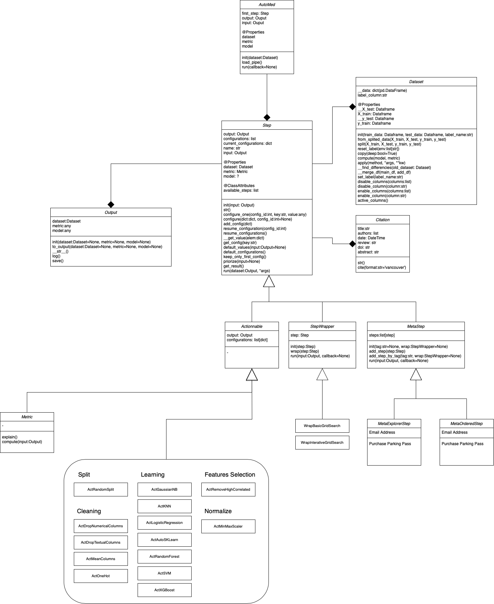

# Technical Architecture

The technical architecture was create to reach two goals :
- Be a base to create must more autoML
- Create any self-created and self-explainable data pipelines

In AutoMed, a step is the smallest componante of a pipeline. There is different types of Steps :
- Actionable : Step that will do an action. For example : Modify Dataset Data, Train a model, Choose a metric
- MetaStep : A MetaStep is a Step that contain other Steps (of any type) and execute them. The default behavior is to execute Steps ordered by priority (each Step computed his own priority).
    - OrderedMetaStep : Contained Step will be executed in order
    - ExplorerMetaStep : All Step will be executed in the same time but independently. This will create one pipeline fork by step in the MetaStep. 
- StepWrapper : A StepWrapper contain only one step and will impact execution. For example, GridSearch is a Wrapper of a learning Step (Actionable)