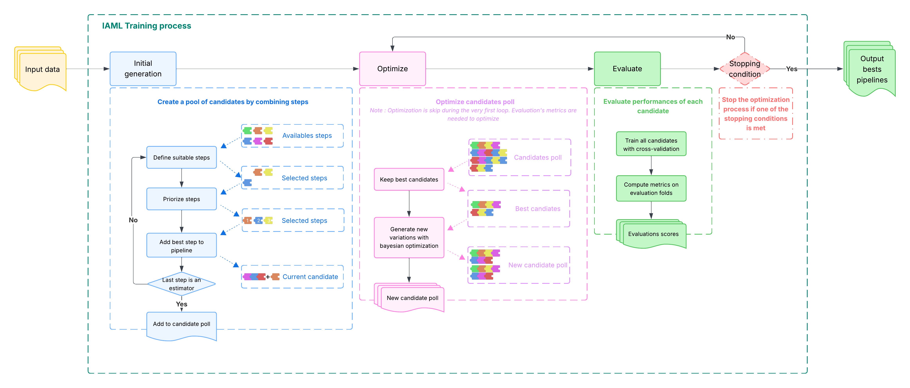

============
How it works
============

IAML (Integrated AutoML for Medical Labs) builds and compares pipelines for
tabular classification, regression and survival analysis. A pipeline combines
data preparation steps with a predictor. A candidate holds that pipeline, its
evaluation metrics and the data needed during the search.

From data to a fitted pipeline
==============================

1. **Generate candidates.** IAML selects components whose tags and suitability
   checks match the data. It explores combinations of cleaning, feature
   selection, normalization, resampling and prediction steps. The default
   genetic search starts with a limited set of preprocessing choices and
   explores alternatives during optimization.
2. **Evaluate candidates.** Each pipeline is fitted and evaluated with
   cross-validation. The default splitter uses five folds, with stratification
   for classification and group separation when groups are supplied. Metrics
   are averaged across folds. The main metric determines candidate ranking.
3. **Optimize candidates.** The default genetic optimizer changes pipeline
   components and parameters, retaining promising candidates for further
   evaluation. Search continues until the time budget, patience limit or
   optimizer stopping condition is reached. Bayesian parameter optimization
   is also available.
4. **Refit the selected pipelines.** IAML fits the best candidates on the
   training data and returns them in ranked order. If ``train_on_n_samples``
   is set, final fitting uses that sample by default. Set
   ``refit_on_sample=False`` to refit on all input rows. The first returned
   candidate is also available as ``chosen_candidate``.

The search time budget does not include every initialization or final fitting
operation, so total wall time can exceed ``max_duration``.

   Training loop illustrated with Bayesian optimization. The default search
   uses genetic mutations. Click to enlarge.

Choose the validation strategy and main metric for the study before starting
the search. Cross-validation scores guide model selection. Use a separate
evaluation dataset to assess the selected pipeline. See :doc:`usage` for
configuration and :doc:`evaluation` for evaluation methods.

Components and extensions
=========================

Most studies interact with ``IAML`` and the selected ``Candidate``. The classes
below explain how data, pipeline construction and evaluation fit together.
Follow a class name for its API reference.

The search and its results
--------------------------

.. list-table::
   :header-rows: 1
   :widths: 25 75

   * - Class
     - Role
   * - :py:class:`~iaml.iaml.IAML`
     - Coordinates candidate generation, validation, optimization and final
       fitting. Holds the search settings and exposes the selected candidate
       through ``chosen_candidate``.
   * - :py:class:`~iaml.dataset.Dataset`
     - Carries features, targets, optional groups and detected data types.
       Steps use this information to check applicability. Splitting and
       sampling keep features, targets and groups together.
   * - :py:class:`~iaml.candidate.Candidate`
     - Combines a pipeline with its dataset, metrics and validation results.
       Provides prediction, held-out evaluation, pipeline descriptions,
       explanations and method references.
   * - :py:class:`~iaml.iaml_pipeline.IAMLPipeline`
     - Holds the ordered transformations, training-only resamplers and final
       predictor. Reuses fitted transformations when predicting new
       observations, without resampling them.

After fitting, ``search.chosen_candidate`` gives access to the results and
reporting methods. Its ``pipeline`` attribute contains the fitted
``IAMLPipeline``, also exposed as ``search.chosen_model``.

Steps and their organization
----------------------------

:py:class:`~iaml.step.Step` defines the shared contract for suitability,
configuration, tags and method references.
:py:class:`~iaml.actionable.Actionable` is the base for concrete transformations,
resampling operations and predictors.
:py:class:`~iaml.predictor.Predictor` specializes it to wrap a learning model
and expose its prediction methods. Probability and survival outputs depend
on the wrapped estimator's capabilities.

Meta steps organize the construction of candidates:

.. list-table::
   :header-rows: 1
   :widths: 30 70

   * - Class
     - Role
   * - :py:class:`~iaml.metastep.MetaStep`
     - Chooses the next child step according to its priority for the current
       candidate.
   * - :py:class:`~iaml.meta_ordered_step.MetaOrderedStep`
     - Runs child steps in the supplied order, such as imputation before
       normalization.
   * - :py:class:`~iaml.meta_explorer_step.MetaExplorerStep`
     - Explores alternatives from the same input candidate, producing
       separate candidates for evaluation.
   * - :py:class:`~iaml.meta_partial_explorer_step.MetaPartialExplorerStep`
     - Starts with one choice or no transformation. Compatible alternatives
       remain available for later mutations, limiting initial branching.

Tags associate registered steps with search stages. The meta steps determine
how those stages are traversed.

Evaluation, optimization and reporting
--------------------------------------

* :py:class:`~iaml.metric.Metric` defines how predictions are scored, which
  prediction method is needed and whether larger or smaller values are
  preferable. The main metric controls candidate ranking.
* :py:class:`~iaml.optimizers.optimizer.Optimizer` proposes the next pool from
  evaluated candidates. Genetic optimization can change steps and parameters.
  Bayesian optimization tunes parameters within an existing pipeline structure.
* :py:class:`~iaml.statistic.Statistic` computes descriptive summaries of the
  dataset, such as missing-value counts or feature distributions.
* :py:class:`~iaml.plot.Plot` provides the common interface for figures and their
  export. Specialized classes cover descriptive plots, model performance and
  SHAP views.

Validation splitters are callables. They receive a ``Dataset`` and yield pairs
of training and validation ``Dataset`` objects, allowing study-specific split
strategies without a new base class.

See :doc:`adaptability` for examples of implementing and connecting these
extensions, :doc:`explainability` and :doc:`scientific` for using their outputs,
and :doc:`component_status` to browse component families and their API.
