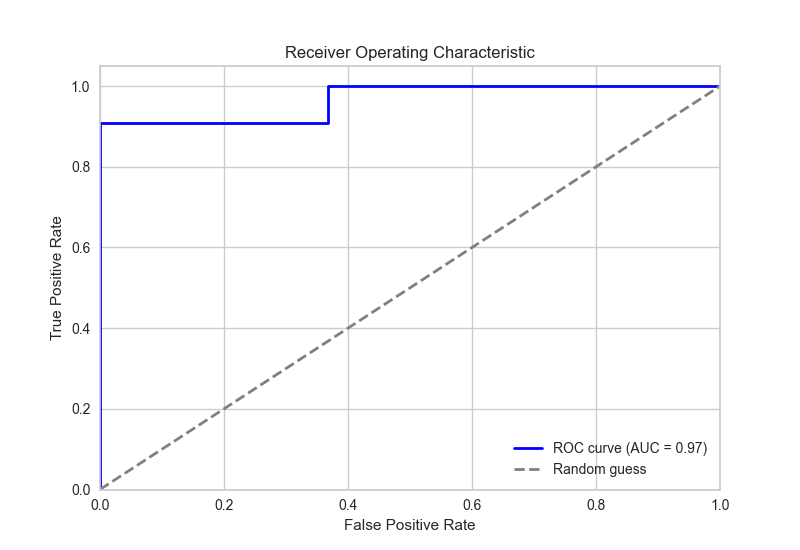
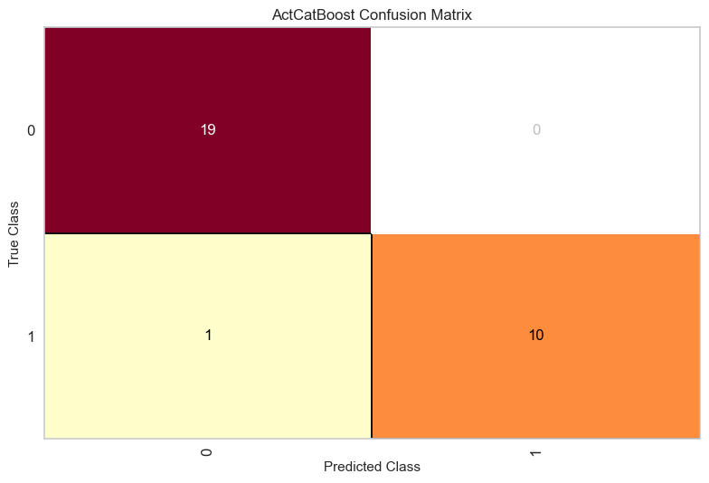
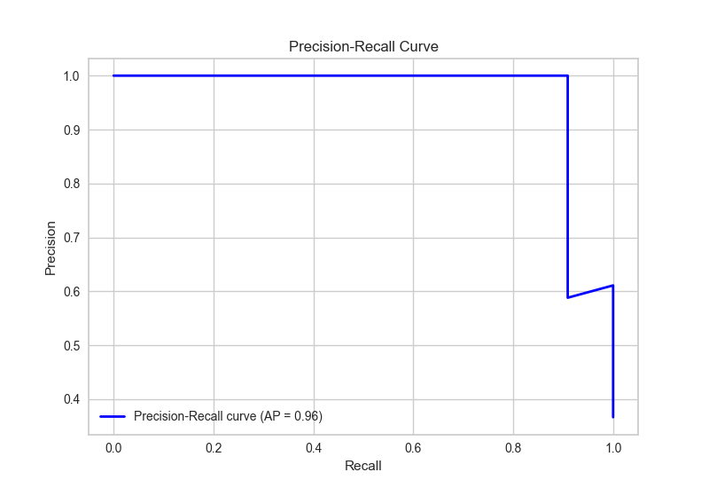
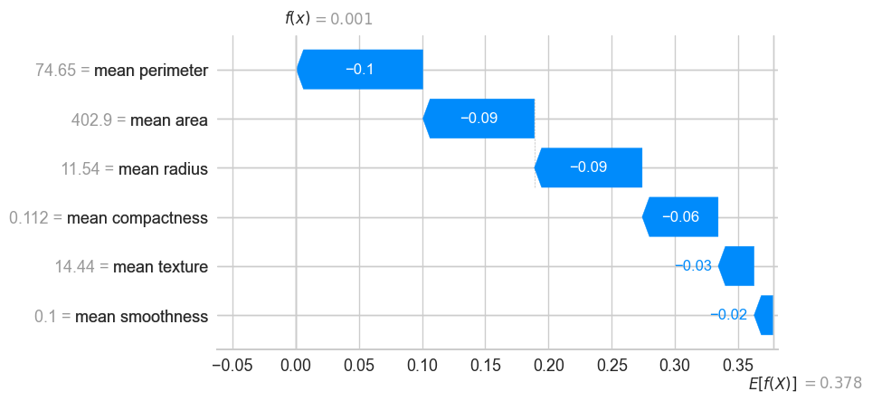
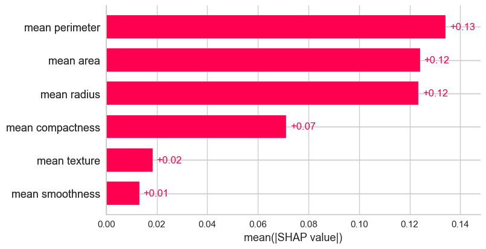

=========================
From data to explanations
=========================

The :doc:`quick_start` gives you a trained, usable pipeline. This example shows
what you can obtain from the same workflow with **performance plots, SHAP
explanations and a record of the analysis**. All figures below come from one
IAML run.

The question is concrete: can measurements in the breast cancer dataset bundled
with scikit-learn distinguish malignant from benign samples? To keep the example
small, we use 120 observations and six features: 90 observations for training
and 30 held out for evaluation. Here, **1 means malignant and 0 means benign**.
The script reverses the original dataset labels to make that convention explicit.

Read the results
================

IAML compares candidates using five-fold cross-validation, then fits the
selected pipeline on the training observations. In the illustrated run it
selected a **CatBoost classifier**, with no additional feature transformation.
The ROC AUC on the held-out observations is **0.967** in this run.

   **Discrimination on held-out data.** The ROC curve shows sensitivity against
   the false-positive rate as the classification threshold changes.

   **See the errors as well as the successes.** The confusion matrix uses the
   classifier's predicted labels. Read 0 as benign and 1 as malignant.

``chosen_model.explain_model_performance(X_test, y_test)`` generates these
figures together with a precision–recall curve, classification report and
prediction-error plot. The script chooses ROC AUC as its objective so that the
selected classifier supports the probabilities needed by these plots.

.. _precision-recall:

   **A complementary view.** The precision–recall curve shows how precision
   and sensitivity change together as the probability threshold varies.

Understand a prediction
========================

   **Why this prediction?** Start at the model's average output on its background
   data, ``E[f(X)]``. Each feature contribution moves it towards the explained
   observation's predicted probability, ``f(x)``. Red increases that probability,
   while blue decreases it.

Here, SHAP explains the probability of class 1, malignant. The example computes
contributions for just five held-out observations. A second figure summarizes
the mean absolute contribution of each feature across those five rows:

   **Which features contribute most in this small subset?** Longer bars mean
   larger contributions, irrespective of their direction.

These are explanations of the model, not evidence that a feature causes the
outcome. This small demonstration is not a clinical validation. Use a
representative evaluation population and explanation sample for a study.

Run the complete example
=========================

Install IAML as shown in the :doc:`quick_start`, save the code below as
``clinical_workflow.py`` and run
``python clinical_workflow.py``. It uses only a bundled dataset, one worker and
a 30-second search budget. Final fitting and plotting add time. Search results
can differ between runs.

.. literalinclude:: examples/clinical_workflow.py
   :language: python
   :start-at: import json

Running the script saves the figures as PNG files and the analysis summary as
JSON in ``iaml_example/`` on your computer. The JSON records the configuration
and scores. It does not save the fitted model. See :doc:`scientific` for details
on recording an analysis.

To retrieve the method references, use ``print(chosen_model.bibliography())``
after fitting. Review this list before citing it. See :ref:`method-bibliography`
for its scope and limitations.

The illustration uses ``nsamples=64`` with six features. This controls SHAP's
sampling effort, separately from the five observations being explained.
See :doc:`explainability` for the explained output, background and interpretation.

To adapt the workflow to your own study, continue with :doc:`usage`,
:doc:`evaluation` and :doc:`scientific`.
